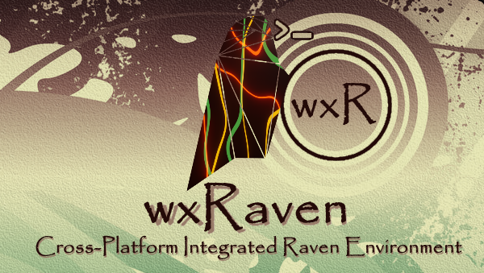
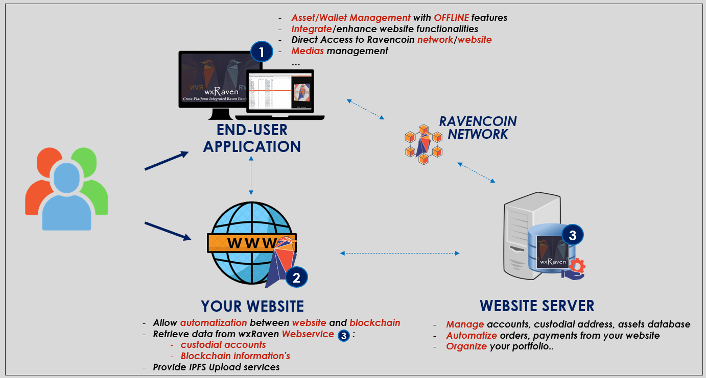

About
-----

wxRaven is a free and open source cross-platform Integrated Environment framework
for the Ravencoin community who want to write advanced GUI applications connected to the Ravencoin blockchain.

It provide a Customizable environment direclty connected to a ravencorewallet.

    


Written in Python 3.x and using the wxWidget Library with the inspiration of Eclipse IDE, wxRaven natively support the plugin approach and the view/perspective concept.

It provides usefull built-in functions to create and develop your own "Use-case specific application" as one or multiple [plugins](plugins/README.md) of this integrated environment itself such as :

- Built-in RPC connexion
- High Level RPC API Commands
- RPC Shell & Command list
- Asset Search, Navigation and more.
- Highly Customizable End User Interface / Components
- ... More to come !
	



Platforms
---------

This version of wxRaven supports the following primary platforms:

- Windows / Linux 


Licence
-------

wxRaven is released under the terms of the MIT license. 
See [COPYING](COPYING.md) for more information or see https://opensource.org/licenses/MIT.


Installation
--------
- Install Python 3.8 or 3.9 & PIP
- Windows: pip install -r requirements.txt
- Linux: python3.7 -m pip install -r requirements.txt

wxRaven will require an available Ravencore Wallet with [RPC server configured](NODECONFIGURATION.md).
For any non-local node, we strongly recommend the usage of SSH to tunnel and encrypt the connexion.

Webview component for Windows (IPFS Preview and Webcontrols) : [here](https://developer.microsoft.com/en-us/microsoft-edge/webview2/)


NOTE : windows users, check the [RELEASES PAGE](https://github.com/sLiinuX/wxRaven/releases) for a no-install version (py2exe).

Further information
-------------------

If you are looking for community support, you can get it from

- [Ravencoin Discord](https://discord.gg/jn6uhur)
- [wxRaven Discord] (https://discord.gg/wry5t636G2)
- Contact the author or any wxRaven Developers


Finally, keep in mind that wxRaven is an open source project collaboratively
developed by its users and your contributions to it are always welcome. Please
check [our guidelines](CONTRIBUTING.md) if you'd like to do it.

```
Have fun!
```
The wxRaven Team.


Screenshots
--------


